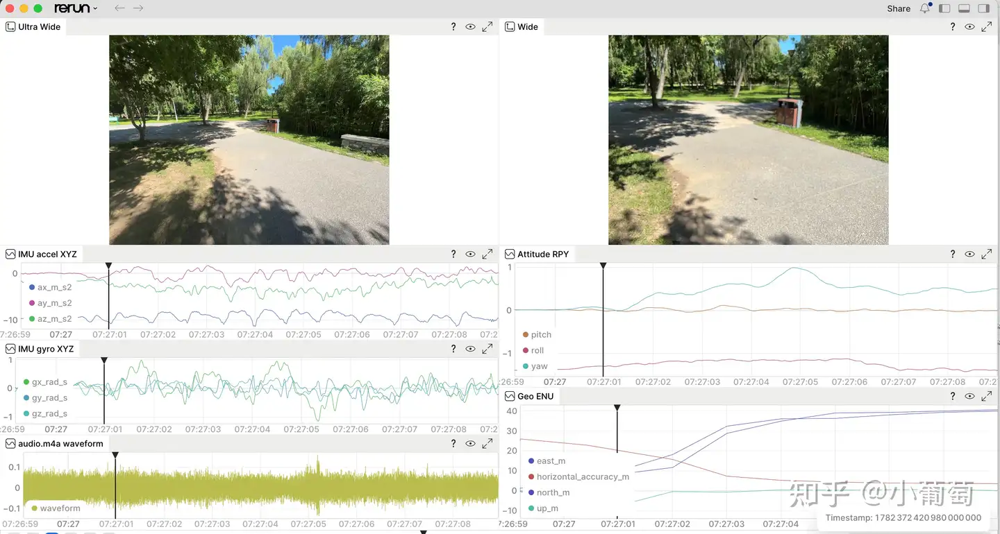
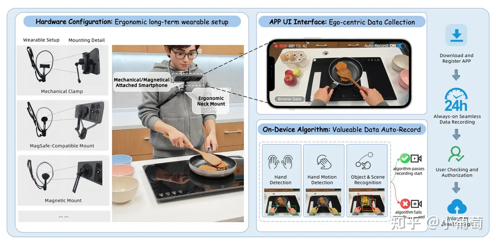
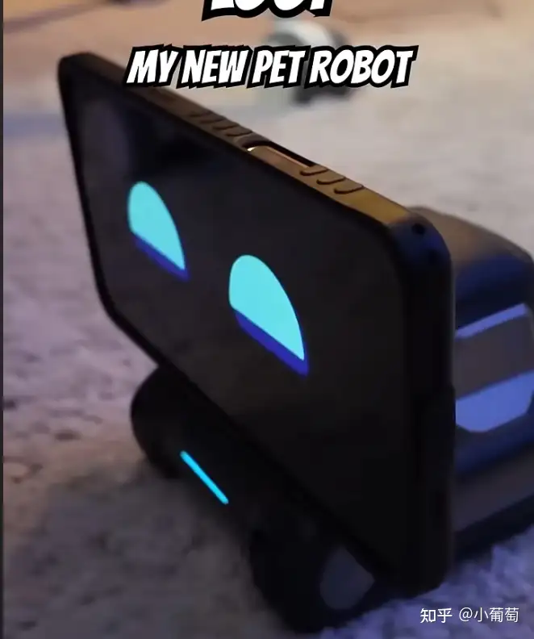
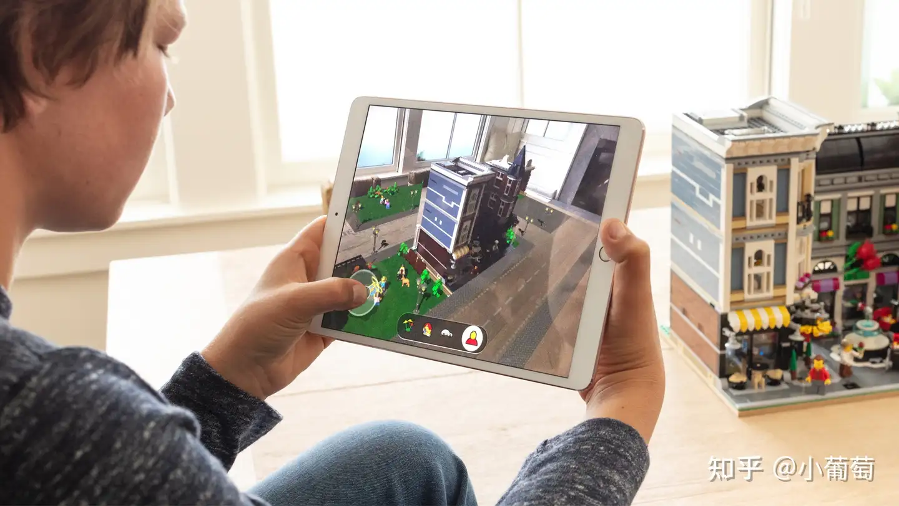
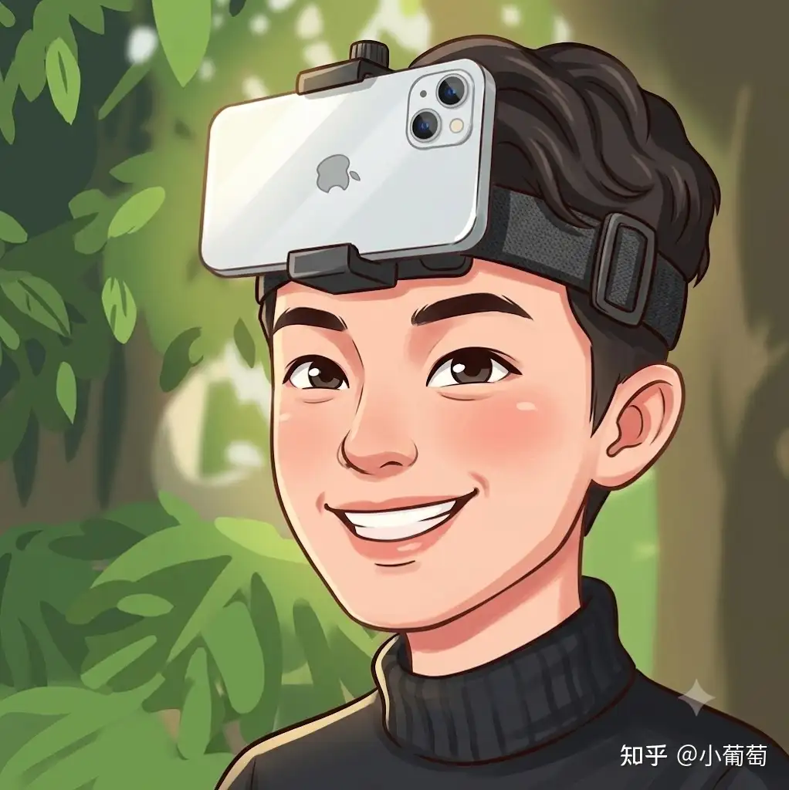

# 把 iPhone 变成科研传感器平台：一个面向 VIO、机器人与具身智能的数据采集工具

English summary: [Turn an iPhone into a research sensor platform](#english-summary-turn-an-iphone-into-a-research-sensor-platform)

最近几年，AR 眼镜、Always-On 设备、具身智能、机器人、无人机、空间计算这些方向都越来越热。它们看起来是不同的产品形态，但底层其实有一个共同点：都需要一套稳定、同步、多模态的传感器系统。

一台 AR 眼镜需要相机、IMU、麦克风、定位、姿态估计；一台机器人需要视觉、惯性、位姿、环境信息；无人机和无人车也需要多传感器时间同步、标定和数据记录。换句话说，真正支撑这些系统工作的，不只是算法模型本身，还有一套可靠的数据采集基础设施。

但这里有一个很现实的问题：高质量的多传感器采集设备通常不便宜，也不容易随手获得。对于很多在校研究生、机器人/视觉工程师、个人极客来说，想快速做一个 VIO、SLAM、具身智能或者多模态感知实验，第一步往往就卡在“数据怎么采”上。

于是我开始重新思考一个问题：我们手里的 iPhone，或者更广义地说智能手机，能不能被更认真地当成一个科研实验平台？

## 手机其实是一套很强的传感器系统

现代智能手机已经不是单纯的消费电子设备了。它里面集成了相当完整的传感器系统：

- 多个高质量相机
- IMU，包括加速度计和陀螺仪
- 磁力计
- 气压计
- GNSS / 地理位置
- 麦克风
- 高性能 SoC
- 稳定的电源、存储和系统 API

如果换一个角度看，iPhone 本身就很像一套小型机器人传感器模组。它有视觉，有惯性，有声音，有位置，有计算能力，而且人人都可以拿到。

在很多实验里，我们并不一定一开始就需要昂贵的工业相机、激光雷达或者专用采集硬件。我们真正需要的是：能够稳定记录原始数据，并且知道每条数据在什么时候被采集。

这正是我想做 SensorRec 的原因。

## SensorRec 想解决什么问题

SensorRec 是一个面向科研、机器人、VIO、AR/VR、具身智能和个人极客的数据采集 App。它的目标很简单：

让 iPhone 成为一个低成本、易使用、可复现的多传感器数据记录平台。

目前它可以记录：

- Wide Camera 视频
- Ultra-Wide Camera 视频
- 相机内参、曝光、ISO、时间戳等帧级信息
- IMU 原始数据，包括加速度和角速度
- 磁力计
- 气压计
- Device Motion
- Geo Location
- 音频
- 设备信息和整体 `meta.json`

我希望它不是一个“拍视频 App”，而是一个“实验数据采集 App”。

比如你可以把 iPhone 固定在机器人、无人机、车辆、手持支架、AR 设备原型上，然后采集一段完整的数据。后续可以离线转换成 MCAP、ROS2 bag、Rerun 数据包，或者自己的训练数据格式。

## 为什么不是一开始就做成复杂系统

很多工程系统一上来就会想做得很完整：实时编码、实时同步、实时打包、实时上传、实时可视化，甚至直接在手机端写 MCAP 或 ROS bag。

但我目前更倾向于一个务实的路线：

第一阶段，手机端只负责稳定、可靠、低负担地记录原始数据。

第二阶段，在 Mac 或 Linux 上做离线打包、同步、校验和格式转换。

这样做的好处是，手机端不会承担太重的实时压力。视频就写成标准 mp4，音频写成 m4a，传感器写成 csv，整体信息写入 `meta.json`。后处理工具再把这些数据转换成 Rerun、MCAP 或 ROS2 可用的格式。

对科研来说，这种方式也更透明。你可以直接打开 csv 看每一行数据，也可以用 ffmpeg、Python、ROS 工具链做后处理。

## 时间戳与多传感器对齐

这类工具最关键的不是 UI，而是时间戳。

SensorRec 会尽量保留两类时间：

- 单调递增的传感器时间，用于相机、IMU、音频等数据对齐
- UTC 时间，用于和 GNSS、外部事件、实验日志对齐

相机视频本身保存在 mp4 中，但每一帧会在对应的 `info.csv` 中记录帧号、采集时间、曝光、相机参数等信息。后处理时，可以通过视频解码帧序号和 `info.csv` 中的 frame index 做严格对应。

这对 VIO、SLAM、多传感器融合非常重要。因为我们最终关心的不是“视频看起来顺不顺”，而是每一帧图像和 IMU 数据在时间轴上能不能对齐。

## 它可以用来做什么

我希望 SensorRec 可以服务几类人：

研究生可以用它快速采集 VIO、SLAM、AR、机器人实验数据，不需要一开始就搭建复杂硬件。

工程师可以用它做算法验证、现场数据记录、传感器行为分析。

极客玩家可以把手机固定到无人机、小车、机械臂、头戴设备上，做自己的多模态数据集。

具身智能方向的同学可以用它采集视觉、惯性、音频、位置等多模态数据，用于后续训练、回放和分析。

它不是为了替代专业设备，而是为了降低第一步实验的门槛。很多时候，能不能快速采到一批可用数据，会直接决定一个想法能不能继续往前走。

## 开源与 App Store

我目前有两个计划。

第一个计划是开源代码。这样大家可以直接看到实现方式，自己编译、修改、扩展，也可以一起把它做成更通用的科研数据采集工具。

GitHub 地址会放在这里：

[https://github.com/ydsf16](https://github.com/ydsf16)

第二个计划是上架 App Store。因为并不是每个人都有能力或时间自己编译 iOS 工程。一个可以直接安装使用的版本，对国外用户、工程师和非 iOS 开发者会更友好。

我的想法是：开源版本保证透明和可扩展，App Store 版本提供低门槛使用体验。如果这个工具真的帮到一些人，收一点费用也可以支持后续维护。

## 后续计划

接下来我希望继续完善几个方向：

- 离线转换工具：导出 Rerun 数据包，用于可视化回放
- MCAP / ROS2 支持：方便接入机器人生态
- 更完整的相机标定与外参管理
- 更严格的数据完整性校验
- 更好的文件导出与数据管理
- 更多设备型号的兼容测试

长期来看，我希望 SensorRec 能成为一个小而可靠的“手机科研采集平台”。它不一定复杂，但要足够稳定、透明、好用。

## 结语

智能手机可能是我们最容易忽视的科研设备。

它已经拥有相机、IMU、麦克风、定位、计算、存储和电池。它不像实验室设备那样昂贵，也不像机器人平台那样难以复制。它就在每个人口袋里。

如果我们把它当成一个认真可用的传感器平台，也许很多 AR、机器人、具身智能、VIO、多模态感知的实验，都可以更低成本地开始。

这就是我做 SensorRec 的初衷：释放 iPhone 和智能手机作为科研工具的能力，让更多人可以方便地记录真实世界的数据。

## 参考图：手机作为 Always-On / Ego-centric 传感器

这些图不是 Sensor Recorder Pro 的产品截图，而是这篇文章想表达的方向：手机可以成为随身、低成本、可复现的第一人称数据采集设备。

## English Summary: Turn an iPhone into a research sensor platform

Modern phones are no longer just consumer devices. An iPhone already contains high-quality cameras, IMU, magnetometer, barometer, GNSS/location, microphones, storage, battery, and a stable software platform. For many robotics, VIO, SLAM, AR/VR, embodied AI, and multimodal sensing experiments, this is already a capable sensor package.

Sensor Recorder Pro is built around one practical idea: use the phone as a reliable data collection platform first, then do synchronization, validation, visualization, and format conversion offline.

The app records:

- Wide and ultra-wide camera videos.
- Per-frame camera indexes with timestamps, exposure, ISO, resolution, and intrinsics.
- Raw accelerometer and gyroscope streams.
- Gyro-keyed IMU rows.
- CoreMotion device motion.
- Magnetometer, barometer, Geo location, and audio.
- A `meta.json` manifest describing schemas, codecs, device information, and timestamp semantics.

The most important design choice is the time model. Every stream keeps:

- `sensor_sec`: a monotonic sensor timeline for camera, IMU, audio, and motion alignment.
- `utc_sec`: Unix UTC time for wall-clock, Geo, external events, and experiment logs.

This keeps the phone-side recorder simple and robust. Videos stay as standard MP4 files, audio stays as M4A, sensors stay as CSV, and the offline tools convert the session into Rerun for visual playback and inspection.

The Rerun post-processing view shows:

- Ultra-wide and wide camera streams side by side.
- IMU acceleration and gyro curves.
- The raw `audio.m4a` waveform.
- Attitude roll/pitch/yaw.
- Geo position converted into relative east/north/up meters.

The long-term goal is to make iPhone-based data capture useful for researchers, engineers, and builders who want real-world multimodal data without starting from expensive custom hardware.
