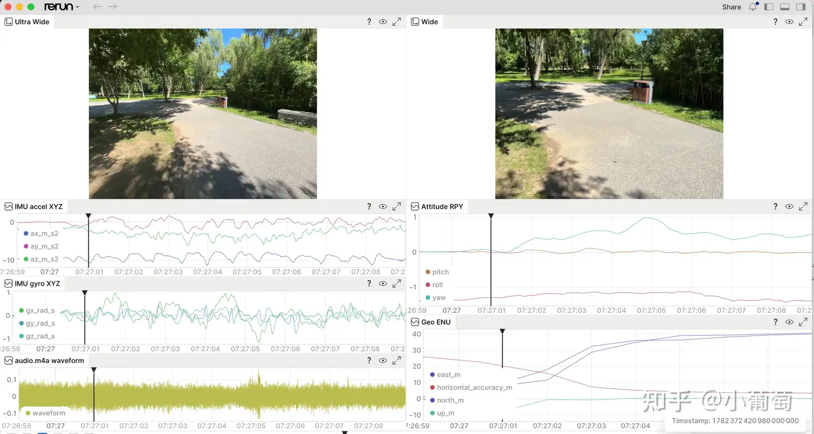

# Sensor Recorder Pro

## English

### Summary

Sensor Recorder Pro turns an iPhone into a low-cost, reproducible, multi-sensor data recorder for VIO, SLAM, robotics, XR, embodied AI, Physical AI, and field experiments.

### Downloads

- App Store: [Sensor Recorder Pro](https://apps.apple.com/search?term=Sensor%20Recorder%20Pro)
- Open data: [Baidu Netdisk](https://pan.baidu.com/s/1AkZOUvUq2zS3ihPHkEMs9g), password: `inv0`

The app records timestamped real-world signals from iPhone hardware:

- Up to three selected camera streams from wide, ultra-wide, telephoto, and front cameras. Unsupported MultiCam combinations are automatically trimmed.
- Per-frame camera metadata: timestamp, exposure, ISO, resolution, and intrinsics.
- Optional ARKit mode with Landscape Right RGB video and per-frame 6-DoF camera pose; scene depth is available on supported devices when enabled.
- Audio from `audio.m4a`.
- Raw accelerometer and gyroscope data.
- Gyro-keyed IMU rows.
- CoreMotion device motion, including attitude, gravity, user acceleration, and rotation rate.
- Magnetometer, barometer, and Geo location.
- LiDAR raw depth maps on supported devices, saved as 16-bit PNG depth in millimeters with a CSV index.
- Adaptive preview layout for 1-3 RGB cameras plus optional depth preview.
- A `meta.json` manifest with device metadata, capture settings, schemas, codecs, and timestamp semantics.

Each session is saved as a folder named `SR_yyyy-MM-dd_HH-mm-ss/`. The phone keeps recording simple and robust: videos stay as MP4, audio stays as M4A, sensor streams stay as CSV, and offline tools convert the session for visualization and analysis.

### Capture modes

This README describes the `release` branch's on-device recording workflow. USB Stream mode and desktop live-preview tools are developed separately on `feature/stream_mode` and are not part of this release.

| Mode | Camera capture | Pose and depth |
| --- | --- | --- |
| Standard | Up to three supported RGB cameras using AVFoundation; each camera has its own video and frame metadata. | No ARKit world-camera pose. Optional LiDAR depth on supported devices. |
| ARKit | One ARKit RGB stream using `ARWorldTrackingConfiguration`; the Standard mode's extra camera streams are not recorded in this mode. | Per-frame 6-DoF pose, tracking state and intrinsics; optional ARKit `sceneDepth` when supported. |

To record with ARKit:

1. Open Settings and select **Capture Mode → ARKit**. Devices without world-tracking support only offer Standard mode.
2. Configure the ARKit camera's resolution, frame rate, focus and exposure. The app selects from the device's supported ARKit video formats; requested and actual settings can differ.
3. Enable the required sensor channels and, if supported, **LiDAR Depth**. RGB + pose recording does not require scene-depth support.
4. Return to the Landscape Right preview, start recording, then stop and export the session folder.

ARKit recordings use `wide.mp4` for RGB and `arkit_pose.csv` for frame timestamps, position, quaternion, tracking state, exposure and camera intrinsics. Depth, when available, uses `lidar_depth/` and `lidar_depth_info.csv`; enabled audio/sensor streams retain their normal files. `meta.json` records the capture mode and settings.

ARKit pose is an estimated trajectory, not ground truth. Check `tracking_state` before using it for evaluation or sensor fusion. Equal camera frame rates and comparable timestamps do not guarantee simultaneous exposure. See the coordinate convention below before consuming pose data.

LiDAR depth output, when enabled, is stored as raw frame files:

```text
lidar_depth/
├── depth_000001.png
├── depth_000002.png
└── ...
lidar_depth_info.csv
```

Each `.png` is a 16-bit grayscale depth map in millimeters. Pixel value `0` means invalid depth, and `value / 1000` gives meters. When LiDAR Depth is enabled, camera capture and recording are capped at 10Hz; high resolutions may still drop frames. `lidar_depth_info.csv` stores frame time, UTC time, file name, resolution, pixel format, depth range, scale, and intrinsics.

### Time model

Every stream carries two timestamps when available:

- `sensor_sec`: monotonic sensor time for camera, IMU, audio, motion, and sensor fusion alignment.
- `utc_sec`: Unix UTC time for wall-clock correlation, Geo data, external logs, and experiment notes.

Use `sensor_sec` for sensor alignment. Use `utc_sec` when correlating with the outside world.

### ARKit camera convention

ARKit recordings keep `capturedImage` in ARKit's native landscape pixel layout while the app is locked to Landscape Right. `arkit_pose.csv` stores `T_world_camera` in parent-from-child form:

- Camera axes: OpenCV/Rerun `RDF` (`x` right, `y` down, `z` forward).
- World axes: ARKit's right-handed, gravity-aligned world (`y` up).
- Projection: `u = fx * x / z + cx`, `v = fy * y / z + cy`.
- Quaternion order: `qw,qx,qy,qz`.

RGB pixels and intrinsics stay in the same ARKit-native layout; depth pixels and scaled depth intrinsics use that same layout. Camera pose uses OpenCV RDF axes. This convention matches OpenCV, Rerun pinhole cameras, and the camera model used by Kalibr/maplab. A complete maplab VIO configuration still requires calibrated camera-to-IMU extrinsics and time offset.

Video tracks request a `1,000,000` units-per-second media time scale. Each successfully encoded ARKit frame and its pose row share the same source presentation timestamp; the final MP4 time base should still be verified on the target device.

### Build and run

1. Open `SensorRecorder.xcodeproj` in Xcode.
2. Set your signing team in `Project -> Signing & Capabilities`.
3. Connect an iPhone; multi-camera recording requires MultiCam support, and ARKit mode requires ARKit world-tracking support.
4. Build and run on device.

The current capture pipeline targets iOS 15.4+.

### Post-processing

Convert a completed session to Rerun:

```bash
python3 -m pip install rerun-sdk numpy pillow
python3 tools/convert_recording.py /path/to/SR_yyyy-MM-dd_HH-mm-ss -o recording.rrd
rerun recording.rrd
```

In Standard mode, the converter uses `wide_info.csv`, `ultra_info.csv`, optional `tele_info.csv`, and optional `front_info.csv` as the source of truth for camera frame time. In ARKit mode, `wide.mp4` uses `arkit_pose.csv` when a standard camera index is absent. The converter identifies ARKit sessions by the presence of `arkit_pose.csv` and warns if that file evidence disagrees with `meta.json`. It decodes MP4 frames with local `ffmpeg`, logs images into Rerun, and restores every logged frame onto the recorded `sensor_time` timeline from `sensor_sec`. It also logs `utc_time` when available.

By default video is written to Rerun at up to 5fps to keep long recordings manageable. Use `--video-fps 0` to write every frame.

LiDAR depth PNGs are logged into Rerun as depth images, and every depth frame is reconstructed into a point cloud from `fx/fy/cx/cy` in `lidar_depth_info.csv`. Use `--depth-pixel-stride 1` for full-resolution point clouds; the default stride is 2 to keep `.rrd` files manageable.

The Standard-mode Rerun layout shows the available streams:

- Top: ultra-wide, wide, optional telephoto, and optional front image streams.
- Lower left: IMU acceleration, gyro, and raw `audio.m4a` waveform.
- Lower right: attitude roll/pitch/yaw and Geo ENU curves in meters.

For ARKit sessions, the converter configures an ARKit camera view, a 3D trajectory view and pose XYZ curves, plus available depth and sensor views. The same conversion command applies to both modes.



### License

The source code is released under [GPLv3](http://www.gnu.org/licenses/) license.

For commercial inquiries, please contact WeChat: YDSF16 or email: ydsf16@163.com.

### Articles

- [English blog: Turn an iPhone into a real-world data recorder](BLOG_EN.md)
- [中文文章：把手机变成数据采集器](BLOG_ZH.md)

## 中文

### 摘要

Sensor Recorder Pro 把 iPhone 变成一个低成本、可复现、多模态的真实世界数据采集器，面向 VIO、SLAM、机器人、XR、具身智能、Physical AI 和科学实验。

### 下载与数据

- App Store 下载：[Sensor Recorder Pro](https://apps.apple.com/search?term=Sensor%20Recorder%20Pro)
- 开放数据：[百度网盘](https://pan.baidu.com/s/1AkZOUvUq2zS3ihPHkEMs9g)，密码：`inv0`

这个 App 可以记录带时间戳的 iPhone 多源传感器数据：

- 从 wide、ultra-wide、telephoto、front 中任选最多三路相机视频。不支持的 MultiCam 组合会自动裁剪。
- 每帧相机信息：时间戳、曝光、ISO、分辨率、相机内参。
- 可选 ARKit 模式：保存 Landscape Right RGB 视频和逐帧 6-DoF 相机 Pose；在支持的设备上开启后可记录 scene depth。
- `audio.m4a` 音频。
- 原始加速度计和陀螺仪。
- gyro 对齐的 IMU 数据。
- CoreMotion device motion，包括姿态、重力、用户加速度和旋转速度。
- 磁力计、气压计和 Geo 位置。
- 支持 LiDAR 的设备会保存原始 depth map，以 16-bit PNG 毫米深度图加 CSV 索引保存。
- 预览区会根据 1-3 路 RGB 相机和可选 Depth tile 自动铺满横屏。
- `meta.json`，记录设备信息、采集设置、schema、codec 和时间模型。

每次录制会保存为一个 `SR_yyyy-MM-dd_HH-mm-ss/` 文件夹。手机端只负责稳定记录原始数据：视频保存为 MP4，音频保存为 M4A，传感器保存为 CSV，后处理工具再把 session 转换成适合可视化和分析的格式。

### 采集模式

本 README 描述 `release` 分支的手机本地录制流程。USB Stream 模式和电脑实时预览工具在 `feature/stream_mode` 分支独立开发，尚不属于当前 release。

| 模式 | 相机采集 | Pose 与深度 |
| --- | --- | --- |
| Standard | 使用 AVFoundation 采集最多三路受设备支持的 RGB 相机，各自保存视频与逐帧元数据。 | 不输出 ARKit 世界坐标相机 Pose；支持的设备可选录制 LiDAR 深度。 |
| ARKit | 使用 `ARWorldTrackingConfiguration` 采集一路 ARKit RGB；此模式不录制 Standard 模式的其他相机流。 | 逐帧 6-DoF Pose、跟踪状态和内参；支持时可选录制 ARKit `sceneDepth`。 |

ARKit 录制步骤：

1. 打开设置，选择 **Capture Mode → ARKit**。不支持世界跟踪的设备只提供 Standard 模式。
2. 配置 ARKit 相机的分辨率、帧率、对焦和曝光。App 从设备支持的 ARKit 视频格式中选择，实际参数可能与请求参数不同。
3. 开启需要的传感器；支持时可开启 **LiDAR Depth**。仅录制 RGB＋Pose 不要求设备支持 scene depth。
4. 回到 Landscape Right 横屏预览，开始录制，结束后导出 session 文件夹。

ARKit 模式使用 `wide.mp4` 保存 RGB，使用 `arkit_pose.csv` 保存逐帧时间戳、位置、四元数、跟踪状态、曝光及相机内参。可用的深度保存到 `lidar_depth/` 和 `lidar_depth_info.csv`；已开启的音频、传感器仍使用各自常规文件。`meta.json` 记录采集模式和设置。

ARKit Pose 是估计轨迹，不是真值。用于评估或传感器融合前应检查 `tracking_state`。相同相机帧率和可比较的时间戳不代表同时曝光；使用 Pose 前请核对下方坐标约定。

LiDAR depth 开启时会固定输出：

```text
lidar_depth/
├── depth_000001.png
├── depth_000002.png
└── ...
lidar_depth_info.csv
```

每个 `.png` 是 16-bit 灰度深度图，单位是毫米。像素值 `0` 表示无效深度，`value / 1000` 得到米制深度。开启 LiDAR Depth 后，相机采集和录制帧率上限为 10Hz；高分辨率下仍可能丢帧。`lidar_depth_info.csv` 保存帧时间、UTC 时间、文件名、分辨率、像素格式、深度范围、scale 和内参。

### 时间模型

每条数据尽量保留两种时间：

- `sensor_sec`：单调递增的传感器时间，用于相机、IMU、音频、姿态等多源数据对齐。
- `utc_sec`：Unix UTC 时间，用于和真实世界时间、Geo、外部日志、实验记录关联。

传感器融合和对齐优先使用 `sensor_sec`。需要和外部世界关联时使用 `utc_sec`。

### ARKit 相机坐标约定

App 锁定为 Landscape Right；ARKit 录制保留 `capturedImage` 的原生横屏像素，不再手工旋转。`arkit_pose.csv` 保存 parent-from-child 形式的 `T_world_camera`：

- 相机坐标：OpenCV/Rerun `RDF`，即 `x` 向右、`y` 向下、`z` 向前。
- 世界坐标：ARKit 右手、重力对齐世界，`y` 向上。
- 投影：`u = fx * x / z + cx`，`v = fy * y / z + cy`。
- 四元数顺序：`qw,qx,qy,qz`。

RGB 像素与 RGB 内参保持 ARKit 原生对应；深度像素及缩放后的深度内参使用相同布局；相机 Pose 使用 OpenCV RDF 坐标。可直接对应 OpenCV、Rerun pinhole 和 Kalibr/maplab 相机模型。完整接入 maplab VIO 仍需标定 camera-to-IMU 外参和时间偏移。

视频轨道请求使用每秒 `1,000,000` 单位的媒体时间基。每个成功编码的 ARKit 图像帧与对应 Pose 行复用同一个源 PTS；最终 MP4 时间基仍需在目标真机上复测。

### 编译运行

1. 用 Xcode 打开 `SensorRecorder.xcodeproj`。
2. 在 `Project -> Signing & Capabilities` 设置自己的签名团队。
3. 连接 iPhone；多摄录制要求设备支持 MultiCam，ARKit 模式要求支持 ARKit 世界跟踪。
4. 在真机上编译运行。

当前采集链路目标版本是 iOS 15.4+。

### 后处理

把一次录制转换成 Rerun：

```bash
python3 -m pip install rerun-sdk numpy pillow
python3 tools/convert_recording.py /path/to/SR_yyyy-MM-dd_HH-mm-ss -o recording.rrd
rerun recording.rrd
```

Standard 模式下，转换器以 `wide_info.csv`、`ultra_info.csv`、可选的 `tele_info.csv` 和可选的 `front_info.csv` 作为相机帧时间戳的来源。ARKit 模式下，`wide.mp4` 在没有标准相机索引时使用 `arkit_pose.csv`。转换器根据 `arkit_pose.csv` 是否存在识别 ARKit session，若与 `meta.json` 的模式不一致则发出警告。它用本地 `ffmpeg` 解码 MP4，把图像写入 Rerun，并把每一帧恢复到原始 `sensor_sec` 对应的 `sensor_time` 时间轴；可用时也会写入 `utc_time`。

默认视频最多按 5fps 写入 Rerun，避免长时间录制生成过大的 `.rrd` 文件。使用 `--video-fps 0` 可以写入每一帧。

LiDAR depth PNG 会作为 depth image 写入 Rerun，并根据 `lidar_depth_info.csv` 里的 `fx/fy/cx/cy` 为每一帧恢复点云。默认点云像素 stride 为 2，避免 `.rrd` 文件过大；使用 `--depth-pixel-stride 1` 可输出全分辨率点云。

Standard 模式的 Rerun 布局按实际可用数据展示：

- 上方：ultra-wide、wide、可选 telephoto 和可选 front 图像。
- 左下：IMU acceleration、gyro、从 `audio.m4a` 解码的原始音频波形。
- 右下：attitude roll/pitch/yaw 和 Geo ENU 米制曲线。

ARKit session 会配置 ARKit 相机视图、3D 轨迹视图和 Pose XYZ 曲线，并展示可用的深度与传感器视图。两种模式使用相同的转换命令。

### 许可证

源码采用 [GPLv3](http://www.gnu.org/licenses/) 许可证发布。

商业合作请联系微信：YDSF16，或邮箱：ydsf16@163.com。

### 文章

- [English blog: Turn an iPhone into a real-world data recorder](BLOG_EN.md)
- [中文文章：把手机变成数据采集器](BLOG_ZH.md)
